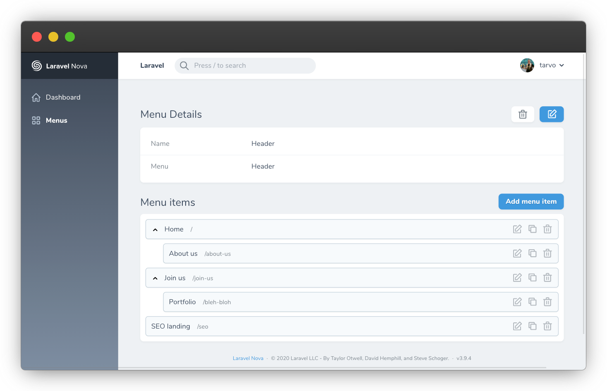

# Nova Menu Builder

[](https://packagist.org/packages/outl1ne/nova-menu-builder)
[](https://packagist.org/packages/outl1ne/nova-menu-builder)

This [Laravel Nova](https://nova.laravel.com/) package allows you to create and manage menus and menu items.

## Requirements

- `php: >=8.0`
- `laravel/nova: ^4.0`

## Features

- Menu management
- Menu items management
  - Simple drag-and-drop nesting and re-ordering
- Custom menu item types support
  - Ability to easily add select types
  - Ability to add custom fields
  - Use `menubuilder:type` command to easily create new types
- Fully localizable

## Screenshots




## Installation and Setup

### Installing the package

Install the package in a Laravel Nova project via Composer, edit the configuration file and run migrations.

```bash
# Install the package
composer require outl1ne/nova-menu-builder

# Publish the configuration file and edit it to your preference
# NB! If you want custom table names, configure them before running the migrations.
php artisan vendor:publish --tag=nova-menu-builder-config
```

Register the tool with Nova in the `tools()` method of the `NovaServiceProvider`:

```php
// in app/Providers/NovaServiceProvider.php

public function tools()
{
    return [
        // ...
        \Outl1ne\MenuBuilder\MenuBuilder::make(),

        // Optional customization
        ->name('Menus') // Define a new name for sidebar
        ->icon('adjustments') // Customize menu icon, supports heroicons
        ->hideMenu(false) // Hide MenuBuilder defined MenuSection.
    ];
}
```

### Setting up

After publishing the configuration file, you have to make some required changes in the config:

```php
# Choose table names of your liking by editing the two key/values:
'menus_table_name' => 'nova_menu_menus',
'menu_items_table_name' => 'nova_menu_menu_items',

# Define the locales for your project:
# If your project doesn't have localization, you can just leave it as it is.
# When there's just one locale, anything related to localization isn't displayed.
'locales' => ['en' => 'English'],

# Define the list of possible menus (ie 'footer', 'header', 'main-menu'):
'menus' => [
    // 'header' => [
    //     'name' => 'Header',
    //     'unique' => true,
    //     'menu_item_types' => []
    // ]
],

# If you're just setting up, this is probably of no importance to you,
# but later on, when you want custom menu item types with custom fields
# , you can register them here:
'menu_item_types' => [],
```

Next, just run the migrations and you're set.

```php
# Run the automatically loaded migrations
php artisan migrate
```

### Optionally publish migrations

This is only useful if you want to overwrite migrations and models. If you wish to use the menu builder as it comes out of the box, you don't need them.

```bash
# Publish migrations to overwrite them (optional)
php artisan vendor:publish --tag=nova-menu-builder-migrations
```

## Usage

### Locales configuration

You can define the locales for the menus in the config file, as shown below.

```php
// in config/nova-menu.php

return [
  // ...
  'locales' => [
    'en' => 'English',
    'et' => 'Estonian',
  ],

  // or using a closure (not cacheable):

  'locales' => function() {
    return nova_lang_get_locales();
  }

  // or if you want to use a function, but still be able to cache it:

  'locales' => '\App\Configuration\NovaMenuConfiguration@getLocales',

  // or

  'locales' => 'nova_lang_get_locales',
  // ...
];
```

### Custom menu item types

Menu builder allows you create custom menu item types with custom fields.

Create a class that extends the `Outl1ne\MenuBuilder\MenuItemTypes\BaseMenuItemType` class and register it in the config file.

```php
// in config/nova-menu.php

return [
  // ...
  'menu_item_types' => [
    \App\MenuItemTypes\CustomMenuItemType::class,
  ],
  // ...
];
```

In the created class, overwrite the following methods:

```php
/**
 * Get the menu link identifier that can be used to tell different custom
 * links apart (ie 'page' or 'product').
 *
 * @return string
 **/
public static function getIdentifier(): string {
    // Example usecase
    // return 'page';
    return '';
}

/**
 * Get menu link name shown in  a dropdown in CMS when selecting link type
 * ie ('Product Link').
 *
 * @return string
 **/
public static function getName(): string {
    // Example usecase
    // return 'Page Link';
    return '';
}

/**
 * Get list of options shown in a select dropdown.
 *
 * Should be a map of [key => value, ...], where key is a unique identifier
 * and value is the displayed string.
 *
 * @return array
 **/
public static function getOptions($locale): array {
    // Example usecase
    // return Page::all()->pluck('name', 'id')->toArray();
    return [];
}

/**
 * Get the subtitle value shown in CMS menu items list.
 *
 * @param $value
 * @param $data The data from item fields.
 * @param $locale
 * @return string
 **/
public static function getDisplayValue($value, ?array $data, $locale) {
    // Example usecase
    // return 'Page: ' . Page::find($value)->name;
    return $value;
}

/**
 * Get the value of the link visible to the front-end.
 *
 * Can be anything. It is up to you how you will handle parsing it.
 *
 * This will only be called when using the nova_get_menu()
 * and nova_get_menus() helpers or when you call formatForAPI()
 * on the Menu model.
 *
 * @param $value The key from options list that was selected.
 * @param $data The data from item fields.
 * @param $locale
 * @return any
 */
public static function getValue($value, ?array $data, $locale)
{
    return $value;
}

/**
 * Get the fields displayed by the resource.
 *
 * @return array An array of fields.
 */
public static function getFields(): array
{
    return [];
}

/**
 * Get the rules for the resource.
 *
 * @return array A key-value map of attributes and rules.
 */
public static function getRules(): array
{
    return [];
}

/**
 * Get data of the link visible to the front-end.
 *
 * Can be anything. It is up to you how you will handle parsing it.
 *
 * This will only be called when using the nova_get_menu()
 * and nova_get_menus() helpers or when you call formatForAPI()
 * on the Menu model.
 *
 * @param null $data Field values
 * @return any
 */
public static function getData($data = null)
{
    return $data;
}
```

### Returning the menus in a JSON API

#### nova_get_menus()

A helper function `nova_get_menus` is globally registered in this package which returns all the menus including their menu items in an API friendly format.

```php
public function getMenus(Request $request) {
    $menusResponse = nova_get_menus();
    return response()->json($menusResponse);
}
```

#### Get single menu via identifier

```php
// Available helpers
nova_get_menu_by_slug($menuSlug, $locale = null)
nova_get_menu_by_id($menuId, $locale = null)
```

To get a single menu, you can use the available helper functions.<br />
Returns null if no menu with the identifier is found or returns the menu if it is found. If no locale is passed, the helper will automatically choose the first configured locale.

## Credits

- [Tarvo Reinpalu](https://github.com/Tarpsvo)
- [Eric Lagarda (original nova-menu-builder)](https://github.com/Krato)
- [Ralph Huwiler (vue-nestable)](https://github.com/rhwilr/vue-nestable)

## License

Nova Menu Builder is open-sourced software licensed under the [MIT license](LICENSE.md).
