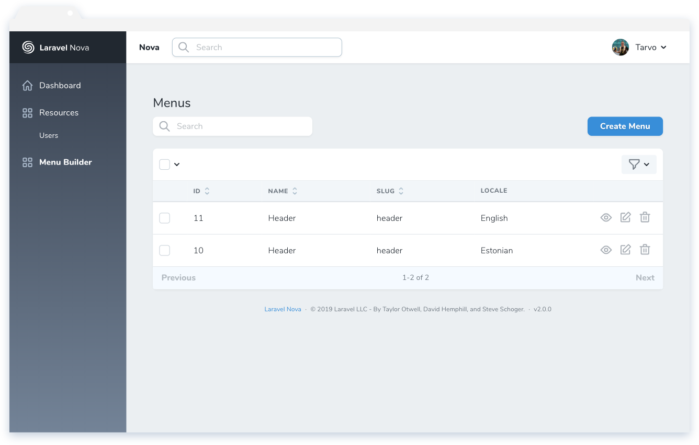
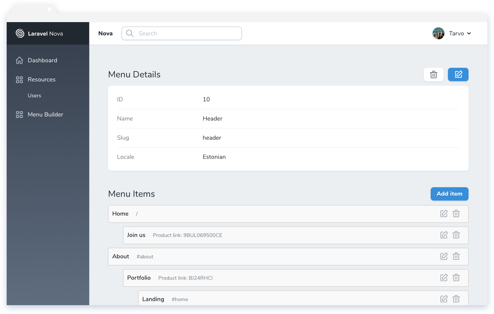
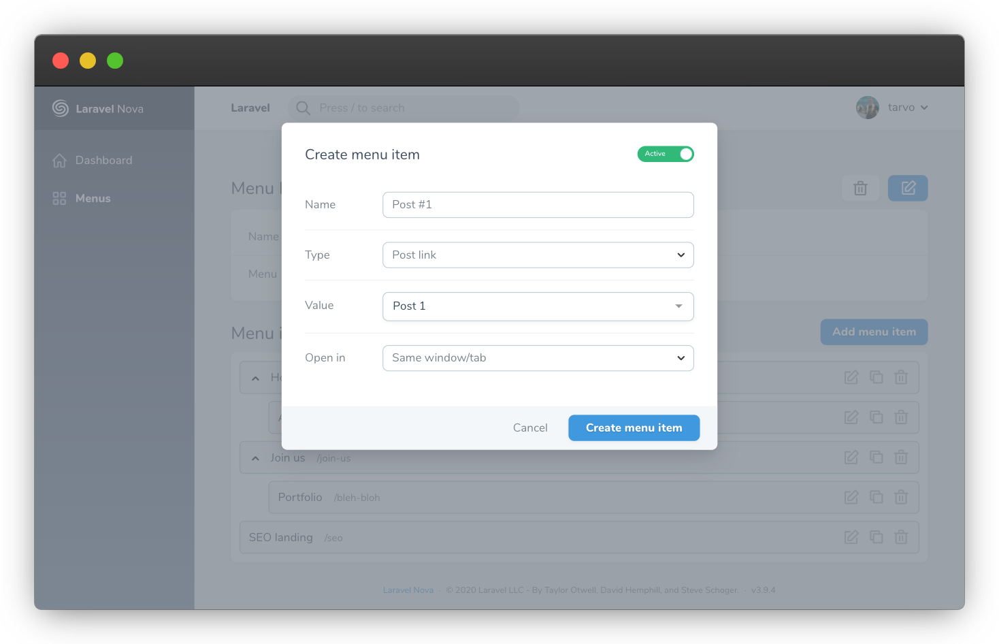

# Nova Menu Builder

[](https://packagist.org/packages/optimistdigital/nova-menu-builder)
[](https://packagist.org/packages/optimistdigital/nova-menu-builder)

This [Laravel Nova](https://nova.laravel.com/) package allows you to create and manage menus and menu items.

Continuation of [Infinety/Nova-Menu-Builder](https://github.com/InfinetyEs/Nova-Menu-Builder). As opposed to the menu builder by InfinityEs, this package is mainly targeted towards the creation of headless content management systems and expects data to be returned through an API.

## Features

- Managing menus (w/ customizable locales) and menu items
- Nesting and re-ordering of menu-items
- Menu items collapse and duplicate options in the UI
- Creation of custom link options (ie links to models such as Page or Product)
- Support for different languages
- Optional `nova-lang` support

## Screenshots







## Installation

Install the package in a Laravel Nova project via Composer, run migrations and edit the config file:

```bash
# Install the package
composer require optimistdigital/nova-menu-builder

# Run automatically loaded migrations
php artisan migrate

# Publish the configuration file and edit it to your preference
php artisan vendor:publish --tag=nova-menu-builder-config
```

Register the tool with Nova in the `tools()` method of the `NovaServiceProvider`:

```php
// in app/Providers/NovaServiceProvider.php

public function tools()
{
    return [
        // ...
        new \OptimistDigital\MenuBuilder\MenuBuilder,
    ];
}
```

### Optionally publish views/migrations

This is only useful if you want to overwrite either the views or migrations. If you wish to use the menu builder as it comes out of the box, you don't need these.

```bash
# Publish views (optional)
php artisan vendor:publish --tag=nova-menu-builder-views

# Publish migrations to overwrite them (optional)
php artisan vendor:publish --tag=nova-menu-builder-migrations
```

## Usage

### Menu locale options

You can define the locales for the menus in the config file.

```php
// in config/nova-menu.php

return [
  // ...
  'locales' => [
    'en_US' => 'English',
    'et_EE' => 'Estonian',
  ],

  // or using a closure:

  'locales' => function() {
    return nova_lang_get_locales();
  }

  // or if you want to use a function, but still be able to cache it:

  'locales' => '\App\Configuration\NovaMenuConfiguration@getLocales',

  // or

  'locales' => 'nova_lang_get_locales',
  // ...
];
```

### Custom `MenuLinkable` classes

Nova menu builder allows you to create a select field for custom models (ie Pages or Products).

Create a class that extends the `OptimistDigital\MenuBuilder\Classes\MenuLinkable` class and register it in the config file.

```php
// in config/nova-menu.php

return [
  // ...
  'linkable_models' => [
    \App\Classes\CustomMenuLinkable::class,
  ],
  // ...
];
```

In the created class, overwrite the following methods:

```php
/**
 * Get the menu link identifier that can be used to tell different custom
 * links apart (ie 'page' or 'product').
 *
 * @return string
 **/
public static function getIdentifier(): string {
    // Example usecase
    // return 'page';
    return '';
}


/**
 * Get menu link name shown in  a dropdown in CMS when selecting link type
 * ie ('Product Link').
 *
 * @return string
 **/
public static function getName(): string {
    // Example usecase
    // return 'Page Link';
    return '';
}


/**
 * Get list of options shown in a select dropdown.
 *
 * Should be a map of [key => value, ...], where key is a unique identifier
 * and value is the displayed string.
 *
 * @return array
 **/
public static function getOptions($locale): array {
    // Example usecase
    // return Page::all()->pluck('name', 'id')->toArray();
    return [];
}

/**
 * Get the subtitle value shown in CMS menu items list.
 *
 * @param string $value
 * @param array $parameters The JSON parameters added to the item.
 * @return string
 **/
public static function getDisplayValue($value = null, array $parameters = null) {
    // Example usecase
    // return 'Page: ' . Page::find($value)->name;
    return $value;
}

/**
 * Get the value of the link visible to the front-end.
 *
 * Can be anything. It is up to you how you will handle parsing it.
 *
 * This will only be called when using the nova_get_menu()
 * and nova_get_menus() helpers or when you call formatForAPI()
 * on the Menu model.
 *
 * @param string $value The key from options list that was selected.
 * @param array $parameters The JSON parameters added to the item.
 * @return any
 **/
public static function getValue($value = null, array $parameters = null) {
    // Example usecase
    // return Page::find($value);
    return $value;
}
```

### Custom menu resource

You can customize the resource controller through the config file.

To avoid controller double-loading [nova-issues #1928](https://github.com/laravel/nova-issues/issues/1928) create it outside of `App\Nova` directory:

```php
// Create app/Menus/MenuResource.php:

namespace App\Menus;

use OptimistDigital\MenuBuilder\Http\Resources\MenuResource as BaseMenuResource;

class MenuResource extends BaseMenuResource {
  //
}

// in config/nova-menu.php:

use App\Menus\MenuResource;

return [
    // ...
    'resource' => MenuResource::class,
    // ...
];
```

### Returning the menus in a JSON API

#### nova_get_menus()

A helper function `nova_get_menus` is globally registered in this package which returns all the menus including their menu items in an API friendly format.

```php
public function getMenus(Request $request) {
    $menusResponse = nova_get_menus();
    return response()->json($menusResponse);
}
```

#### nova_get_menu(\$menuSlug)

To get a single menu, you can use the helper function `nova_get_menu('slug')`. Returns null if no menu with the slug is found or returns the menu if it is found.

## Credits

- [Tarvo Reinpalu](https://github.com/Tarpsvo)
- [Eric Lagarda (original nova-menu-builder)](https://github.com/Krato)
- [Ralph Huwiler (vue-nestable)](https://github.com/rhwilr/vue-nestable)

## License

Nova Menu Builder is open-sourced software licensed under the [MIT license](LICENSE.md).
